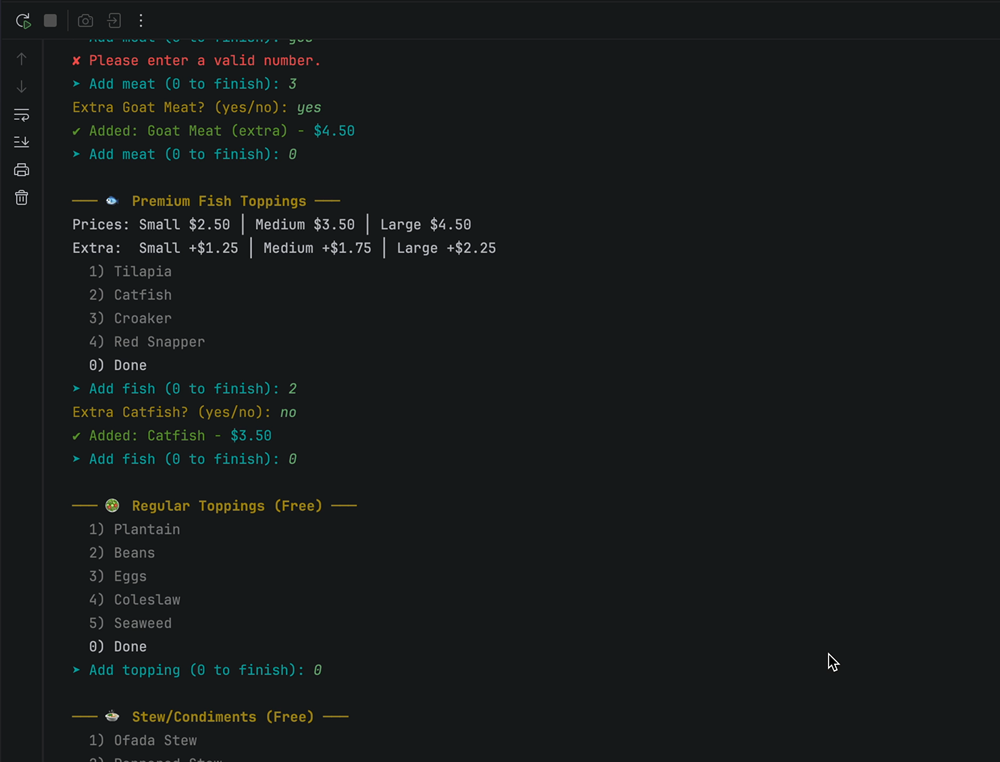

# Dubem's Naija Kitchen

## Description of the Project

This is a Java console point-of-sale application for a Nigerian rice restaurant. Customers can build custom rice bowls by choosing from four rice types, three sizes, and a variety of authentic Nigerian toppings including meats, premium fish, regular sides, and traditional stews. The app also features signature rice bowls that can be customized, drinks, and pastry sides. When an order is confirmed, a timestamped receipt is saved to a file. The app uses object-oriented design with interfaces, abstract classes, inheritance, polymorphism, and Java streams. It is built for anyone who wants a fast, interactive way to place and customize a Nigerian food order from the terminal.

**Slogan:** *"Taste of Home, One Bowl at a Time"*

## User Stories

As a customer, I want to start a new order so that I can begin customizing my meal.

As a customer, I want to choose a rice type (Jollof, Fried, Coconut, or White) and a size (small, medium, or large) so that I can build my rice bowl.

As a customer, I want to add meat toppings (Chicken, Turkey, Goat Meat, Beef, Lamb) and premium fish toppings (Tilapia, Catfish, Croaker, Red Snapper) with the option for extra so that I can customize my protein.

As a customer, I want to add regular toppings (Plantain, Beans, Eggs, Coleslaw, Seaweed) and stew condiments (Ofada Stew, Peppered Stew, Ofe Akwu, Efe Riro) at no extra charge so that I can complete my rice bowl.

As a customer, I want to choose whether my rice is spicy so that the meal matches my preference.

As a customer, I want to add drinks (Zobo, Chapman) in small, medium, or large to my order.

As a customer, I want to add pastry sides (Puff Puff, Meat Pie, Egg Roll) to my order.

As a customer, I want to see my full order details with prices at checkout so that I can verify everything before confirming.

As a customer, I want to cancel my order at any time and return to the home screen so that I'm not locked into a purchase.

As a customer, I want a receipt saved to a file named by the date and time when I confirm my order so that I have a record of my purchase.

As a customer, I want to choose from signature rice bowls (pre-built combos with set toppings) so that I can order quickly without customizing from scratch.

As a customer, I want to add or remove toppings from a signature rice bowl so that I can still personalize it to my taste.

## Setup

Instructions on how to set up and run the project using IntelliJ IDEA.

### Prerequisites

- IntelliJ IDEA: Ensure you have IntelliJ IDEA installed, which you can download from [here](https://www.jetbrains.com/idea/download/).
- Java SDK: Make sure Java SDK is installed and configured in IntelliJ.

### Running the Application in IntelliJ

Follow these steps to get your application running within IntelliJ IDEA:

1. Open IntelliJ IDEA.
2. Select "Open" and navigate to the directory where you cloned or downloaded the project.
3. After the project opens, wait for IntelliJ to index the files and set up the project.
4. Find the `Program` class in `src/main/java/com/pluralsight/`.
5. Right-click on the file and select 'Run Program.main()' to start the application.

## Technologies Used

- Java 17
- **Git & GitHub** for version control
- `java.io` — File, BufferedWriter, FileWriter for receipt file generation
- `java.time` — LocalDateTime, DateTimeFormatter for receipt timestamps
- `java.util` — ArrayList, Scanner for data storage and user input
- `java.util.stream` — IntStream for display loops, stream/mapToDouble/sum for price calculations

## Demo

[Watch the demo video](assets/foodshop-demo.mov)

## UML Class Diagram

![UML Diagram](diagrams/uml-class-diagram.png)

## Future Work

Outline potential future enhancements or functionalities you might consider adding:

- Add a loyalty points system for repeat customers
- Support combo meal deals with bundled pricing
- Add inventory tracking for ingredients
- Add a daily sales summary report that totals all receipts from one day

## Resources

List resources such as tutorials, articles, or documentation that helped you during the project.

- [Java 17 ArrayList Documentation](https://docs.oracle.com/en/java/javase/17/docs/api/java.base/java/util/ArrayList.html)
- [Java 17 BufferedWriter Documentation](https://docs.oracle.com/en/java/javase/17/docs/api/java.base/java/io/BufferedWriter.html)
- [Java 17 LocalDateTime Documentation](https://docs.oracle.com/en/java/javase/17/docs/api/java.base/java/time/LocalDateTime.html)
- [W3Schools Java File Handling](https://www.w3schools.com/java/java_files.asp)
- [ANSI Escape Codes Reference](https://gist.github.com/fnky/458719343aabd01cfb17a3a4f7296797)
- [Baeldung Java ANSI Colors](https://www.baeldung.com/java-ansi-colors)
- https://raymaroun.github.io/yearup-java-visuals/

## Team Members

- **David Amah** - Solo developer. Built all features including rice bowl builder, topping hierarchy with inheritance, signature bowls, drink and pastry ordering, ANSI-styled terminal UI, receipt generation, and input validation with try-catch.

## Thanks

Express gratitude towards those who provided help, guidance, or resources:

- Thank you to Raymond for continuous support and guidance.
